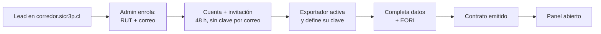
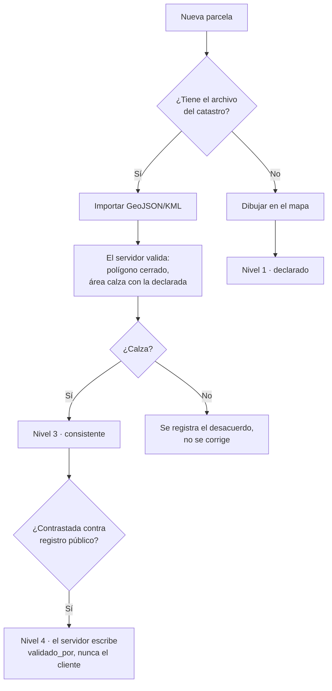
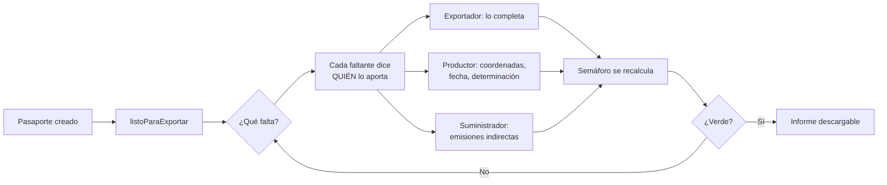

# sicr3p Corredor — plan completo

> Requisitos, captura de datos y flujos end-to-end.
> Alcance y límites: `docs/CORREDOR-ALCANCE.md`. Lógica de regímenes:
> `backend/src/services/exportacion.js`.

---

## 1. Qué es

**La evidencia que una carga necesita para entrar a su mercado de destino.**

Tres regímenes y una cuarta respuesta, ya implementados:

| Régimen | Cuándo aplica | Si falta |
|---|---|---|
| **EUDR** (UE 2023/1115) | Bovinos, cacao, café, palma, caucho, soya, madera | **No se puede comercializar.** No hay arancel que lo compense |
| **CBAM** (UE 2023/956) | Cemento, electricidad, hidrógeno, fertilizantes, hierro/acero, aluminio | El importador declara con **valores por defecto**, más caros |
| **Exportación** | Ninguno de los dos | El comprador no puede usar el dato, y lo va a pedir igual |
| *Sin determinar* | No se declaró el código arancelario | **No se opina.** No cae a «exportación» por defecto |

Ese último renglón es la decisión que más pesa: una carga de soya sin código
declarado **sí** está bajo EUDR, y mostrarla como «solo exportación» la haría
verse en regla justo donde no lo está.

---

## 2. Superficie propia

Igual que el Instituto, que ya funciona así (`frontend/src/App.jsx:66`):

```js
const ES_SUBDOMINIO_CORREDOR = window.location.hostname.startsWith('corredor.');
```

| Pieza | Ruta | Estado |
|---|---|---|
| Landing | `corredor.sicr3p.cl` → `CorredorLanding.jsx` | **Existe** (241 líneas, i18n `cor.*`) |
| Login propio | `/panel-corredor/login` | Nuevo — molde de `PanelLogin.jsx`, compartido por los 7 paneles |
| Activación | `/panel-corredor/activar` | Nuevo — `RUTA_ACTIVAR` en `services/cuentas.js:27` |
| Panel | `/panel-corredor/*` | Nuevo — octavo shell |

### Una base, no dos

**La base de datos sigue siendo una.** Es la decisión más importante de esta
sección y va contra la intuición de «producto aparte, base aparte».

El activo de sicr3p es la cadena encadenada **entre empresas**: subproveedor →
proveedor → exportador → comprador. Una base separada corta exactamente eso,
y con ello se pierde lo único que un competidor no puede copiar. Además el
exportador de una carga es, muchas veces, el proveedor de otra: duplicarlo en
dos bases obliga a reconciliar identidades a mano.

Lo que sí se separa: **la superficie** (dominio, landing, login, marca) y **el
alcance de lectura** (una cuenta de corredor ve sus cargas y nada más, por el
mismo mecanismo de `usuarios.<entidad>_id` que ya aísla a los otros siete
paneles).

---

## 3. Requisitos, campo por campo

Leyenda de «Dónde vive»: ✅ ya existe · ⚠️ existe pero incompleto · ❌ hay que crearlo.

### EUDR — Reglamento (UE) 2023/1115, art. 9

| Requisito | Quién lo aporta | Dónde vive |
|---|---|---|
| Código arancelario | Exportador | ✅ `lotes_minerales.codigo_nc` |
| País y región de producción | Exportador | ⚠️ `pais_origen` sí; región no |
| **Geolocalización de cada parcela** | Productor | ❌ tabla `parcelas` |
| Polígono si la parcela supera 4 ha | Productor | ❌ |
| Fecha o intervalo de producción | Productor | ❌ |
| Libre de deforestación posterior al **31-12-2020** | Productor (con determinación de un tercero) | ❌ |
| Legalidad en el país de producción | Productor | ❌ documentos |
| Operador: nombre, dirección, EORI | Exportador | ❌ tabla de entidad |
| Cantidad | Exportador | ✅ `cantidad` + `unidad` |
| Proveedor y comprador de la operación | Exportador | ⚠️ `lote_eslabones` los tiene como cadena |

**Cuatro de los seis requisitos centrales no tienen dónde guardarse.** Hoy
aparecen como faltantes en `listoParaExportar()`, que es honesto, pero no se
pueden completar.

### CBAM — Reglamento (UE) 2023/956

| Requisito | Quién lo aporta | Dónde vive |
|---|---|---|
| Código NC | Exportador | ✅ |
| Instalación de origen | Exportador | ✅ `faena_origen` |
| Emisiones directas (t CO₂e/t) | Operador de la instalación | ✅ |
| Emisiones indirectas (t CO₂e/t) | **Proveedor de electricidad** | ✅ |
| Método (reales / defecto / mixto) | Exportador | ✅ |

CBAM está completo en el esquema desde la migración 021. Lo que falta no es
modelo: es que el formulario lo pida en vez de ofrecerlo como «(opcional)».

### Exportación (cuando no aplica ninguno)

País de origen, instalación, composición declarada, actores de la cadena y
emisiones incorporadas. Todo ✅ — es el régimen que ya se puede completar.

---

## 4. Cómo se captura cada dato

El corazón del plan. **Casi nada hay que inventar**: los mecanismos existen.

### 4.0 Regla de seguridad: dos coordenadas distintas, y solo una es peligrosa

Esta regla manda sobre todo lo demás de esta sección.

La carga cruza **cuatro países** con niveles de seguridad muy distintos.
Un rastro en vivo de dónde va una carga valiosa es exactamente el mapa que
necesita quien la quiera interceptar. Así que hay que separar dos cosas que
suenan parecido y no lo son:

| | Qué es | Riesgo | Decisión |
|---|---|---|---|
| **Coordenada del predio** | Un campo fijo en Mato Grosso. Ya está en el catastro público (CAR). No dice nada de dónde va la carga | Bajo | **Se captura.** Sin ella no hay EUDR: es obligación del reglamento |
| **Posición del vehículo** | Dónde está la carga **ahora** | **Alto** | **No se captura. Nunca** |

**El sistema hoy ya cumple esto y conviene no romperlo.** `TorreFlota.jsx:150`
dibuja la carga en las coordenadas del **punto de control** —del catálogo
`PUNTOS_CORREDOR`, que son fijos y públicos—, no del camión. Hay un KPI
`sin_posicion` para las cargas sin hito reciente. En todo el corredor no hay
una sola llamada a `getCurrentPosition`: las únicas del repo están en el juego
de reciclaje, que es otro producto.

De ahí la regla, que vale para lo que se construya de acá en adelante:

> **Se registra el hito, no se sigue el móvil.**
> Un evento con marca de tiempo al pasar un punto de control conocido. Nunca
> un rastro continuo, nunca `watchPosition`, nunca un mapa de dónde está la
> carga en este momento.

Y una consecuencia menos obvia: **el hito también es información sensible**.
«Esta carga cruzó tal frontera hace veinte minutos» sirve para lo mismo que
un GPS si llega a quien no corresponde. Por eso el paso se muestra a quien
tiene la carga y a quien la espera, no a cualquiera con un enlace, y el
pasaporte público (`/lote/:codigo`) no lleva el hito más reciente.

### 4.1 La coordenada de una parcela — tres vías, sin poner a nadie en terreno

Con la regla anterior, **quedan fuera el GPS en el predio y el recorrido del
perímetro**. No es una pérdida: la vía que queda como principal es mejor.

Decisión de diseño que sostiene el resto:

> **La procedencia de una coordenada es un nivel de confianza, no un booleano.**

Y no se inventa una escala nueva: se reusa la de `services/expediente.js`
(1 declarado · 2 documentado · 3 consistente · 4 validado en fuente), que ya
tiene sus tests y la regla de quién otorga cada nivel.

| Vía | Cómo | Nivel | Cuándo |
|---|---|---|---|
| **Importar GeoJSON / KML** | Archivo del catastro oficial o del SIG del productor | **3 Consistente** si el polígono cierra y el área calza con la declarada | **La principal.** El CAR brasileño ya tiene el polígono de cada predio rural, cargado por su dueño |
| **Contrastar contra el registro público** | Cruce con el catastro | **4 Validado en fuente** | Exige `validado_por` + `validado_fuente` + `validado_at`, igual que en `datos_trazables` |
| **Dibujar en el mapa** | Leaflet, ya instalado | **1 Declarado** | Último recurso. La precisión la declara quien dibuja, nadie la mide |

Que la vía principal sea un archivo del catastro es mejor por tres razones, no
solo por seguridad: el polígono ya existe, ya lo declaró el dueño ante una
autoridad, y es más preciso que cualquier recorrido con un teléfono.

**Lo que sí se guarda siempre es de dónde salió la coordenada**
(`origen_coordenada`) y, cuando el archivo la trae, su precisión declarada.
Un polígono sin procedencia se ve igual que uno del catastro, y no lo es —
mismo error que `Number(null) === 0`: un dato que parece bueno porque se le
perdió el contexto.

**El nivel 5 no existe acá tampoco**, por la misma razón que en el expediente:
necesitaría un rol de auditor que no existe.

### 4.1.b Y el polígono también hay que cuidarlo

Un polígono de predio + la carga que salió de él + una fecha de embarque es,
junto, «de este campo sale una cosecha valiosa por estas fechas». El
reglamento exige entregar las coordenadas **en la Declaración de Diligencia
Debida ante la autoridad**, no publicarlas a cada contraparte.

Por eso el informe al comprador tiene que poder **acreditar que la parcela
está declarada y verificada sin necesariamente mostrar el polígono completo**
— que es exactamente el estado intermedio «solo acreditar existencia» que ya
estaba pensado para la divulgación selectiva.

### 4.2 Libre de deforestación — sicr3p NO lo determina

El límite más importante de todo el plan.

Determinar que un predio no fue deforestado después del 31-12-2020 exige
**análisis de imágenes satelitales** contra una línea base. sicr3p no hace eso
y no va a decir que lo hace.

Lo que sicr3p hace es **registrar la determinación que hizo otro**, con:

- quién la emitió,
- contra qué línea base (MapBiomas, JRC TMF, Global Forest Watch, informe de
  un consultor),
- en qué fecha,
- y el archivo, con su SHA-256 y su eslabón en la cadena — la misma
  maquinaria de `lote_documentos` que ya existe.

Es exactamente la doctrina de «el nivel 5 nunca se emite»: no se declara una
revisión que nadie hizo.

> **Ojo con la fecha.** El corte del 31-12-2020 aplica a la **deforestación
> del predio**, no a la fecha de producción. Son dos requisitos distintos del
> art. 9 y confundirlos daría por cumplido uno con el otro.

### 4.3 Fecha de producción

Intervalo `desde`/`hasta`, no fecha única: una cosecha es una ventana. El
formulario pide el rango y el backend valida que `desde ≤ hasta`.

### 4.4 Legalidad

Documentos: tenencia de la tierra, permiso ambiental, cumplimiento laboral y
tributario. **Se reusa `lote_documentos` tal cual** — ya trae `sha256`,
`hash_documento`, `hash_anterior`, `hash_cadena`, `estado` y la cola de
revisión. Se agregan tipos al catálogo `TIPO_DOCUMENTO_LABEL`, nada más.

### 4.5 Emisiones (CBAM)

| Dato | Vía |
|---|---|
| Directas | Formulario + documento del balance de la instalación |
| Indirectas | Formulario + factura o certificado del suministrador, **o** factor de red declarado con su fuente |
| Método | Selector de tres opciones, ya validado por CHECK |

El factor de red conecta con las **4 fuentes de factores** que están
pendientes de decisión aparte. Sin fuente declarada, el factor es nivel 1.

### 4.6 Los cruces de frontera

`puntos_corredor` (migración 093) ya tiene los puntos con `lat`, `lng`,
`pais`, `orden` y `es_frontera`. Lo que falta es **qué documento exige cada
par de países** (MIC/DTA, carta de porte, SAG según el par).

Captura en terreno: el QR del punto de control y la Tarjeta de Viaje ya
existen, **y ya funcionan sin señal** — `lib/pasoOffline.js` encola el paso y
lo reintenta. Eso importa por dos motivos: los pasos fronterizos son los
lugares con peor conectividad, y una cola local evita tener que mantener una
conexión abierta con el vehículo.

El escaneo registra **un hito en un punto conocido**, con su hora. No hay
coordenada del vehículo en ese registro, y no debe haberla: el punto de
control ya tiene las suyas en `puntos_corredor`, que son fijas y públicas.

---

## 5. Modelo de datos

### Migración 107 — parcelas, producción y tramo

```
parcelas
  id, exportador_id, nombre, pais, region
  area_ha                       NUMERIC — decide si se exige polígono
  lat, lng                      NUMERIC(9,6)   ← mismo tipo que puntos_corredor
  poligono                      JSONB          — GeoJSON; NULL si ≤ 4 ha
  precision_declarada_m         NUMERIC        — la que trae el archivo, si trae
  origen_coordenada             CHECK (archivo|registro|mapa)
                                -- sin 'gps' ni 'perimetro': ver 4.0
  nivel_confianza               SMALLINT 1..4  ← calculado, NUNCA recibido
  validado_por / _fuente / _at  — solo el servidor los escribe

lote_parcelas                   — una carga puede venir de varias parcelas
  lote_id, parcela_id, aporte_pct

lote_produccion
  lote_id, desde, hasta
  libre_deforestacion_declarado BOOLEAN
  determinacion_emisor          TEXT   — quién la hizo (no sicr3p)
  determinacion_linea_base      TEXT   — contra qué
  determinacion_at              DATE
  determinacion_documento_id    → lote_documentos
  legalidad_declarada           BOOLEAN

lote_tramo
  lote_id, punto_origen, punto_destino  → puntos_corredor

documentos_por_tramo            — qué exige cada par de países
  pais_desde, pais_hasta, tipo_documento, obligatorio
```

**Reglas de la migración** (`migrate.js` no tiene registro y corre todos los
`.sql` en cada arranque, así que una migración que falla tumba el arranque):

- Todo `CREATE TABLE IF NOT EXISTS`.
- **`CREATE TABLE IF NOT EXISTS` NO agrega columnas a una tabla existente** —
  cada columna posterior necesita su `ALTER TABLE ... ADD COLUMN IF NOT EXISTS`
  explícito. Ya se pagó ese error dos veces (`base_prorrateo` en la 105,
  `etapa` en la 106).
- Los CHECK con nombre, en bloque `DO $$ ... IF NOT EXISTS` idempotente.
- Registrar las tablas nuevas en `services/inventarioDatos.js`: hay un test
  que falla si una tabla con datos personales no queda clasificada (Ley
  21.719). `parcelas` lleva la ubicación de un predio y, por la vía del
  catastro, la identidad de su dueño — se clasifica como dato sensible y con
  acceso restringido, por lo de 4.1.b.
- **Ninguna tabla nueva guarda posición de vehículos.** `lote_tramo` referencia
  puntos fijos del catálogo, no coordenadas capturadas en ruta.

### Migración 108 — el exportador como entidad

Molde de los siete paneles existentes: tabla de entidad,
`usuarios.exportador_id`, `panel = 'corredor'` en el CHECK, y la ruta en
`RUTA_ACTIVAR`.

```
exportadores
  id, nombre_empresa, rut, pais
  eori                          — lo exige EUDR para el operador
  direccion, contacto_email
  onboarding_completado_at
```

### El código de la carga

`generarCodigoLote()` (`pasaporteOrigen.js:391`) devuelve `LM-AAAA-NNNNNN`
para todo — «LM» de Lote Mineral. Una carga de soya de Brasil sale
`LM-2026-000001`, lo cual está mal y ya se ve en producción.

**Solo cambia para lotes nuevos.** Los códigos existentes **no se reescriben**:
están sellados en `hash_documento` de sus eslabones y en pasaportes públicos
`/lote/:codigo` que pueden estar compartidos. Reescribirlos rompería la cadena
y los enlaces.

| Tipo | Prefijo |
|---|---|
| `mineral` | `LM-` (sin cambio) |
| `producto` | `LP-` |
| `documental` (Corredor) | `CB-` |

---

## 6. Flujos end-to-end

### Flujo 1 — Alta del exportador



Reusa **entero** el flujo de onboarding que ya existe: `enviarActivacion()`,
el token de 48 h que invalida el anterior, la clave temporal que el admin ve
una sola vez, y la cola de `services/onboarding.js` con sus siete etapas.
Solo cambia el panel de destino.

### Flujo 2 — Alta de una parcela (una vez, se reusa en muchas cargas)



Sin GPS y sin nadie recorriendo un perímetro en zona de frontera. Si el área
del archivo no calza con la declarada, **el desacuerdo se registra, no se
corrige** — mismo criterio que `verificarConsistencia()` con la factura y la
guía, y que `balanceMasas` con la merma.

### Flujo 3 — Crear el pasaporte de una carga

1. **Primero el código arancelario.** No es un campo más: decide el régimen
   y por tanto qué se pregunta después. Es la única forma de no pedirle las
   coordenadas de sus parcelas a un exportador de cátodos.
2. El servidor responde con el régimen y **qué exige**
   (`listoParaExportar()`).
3. El formulario pide **solo eso**, con quién aporta cada dato.
4. Parcelas: se eligen de las ya dadas de alta, con su porcentaje de aporte.
5. Tramo: origen → destino desde `puntos_corredor`.
6. Se crea con código `CB-AAAA-NNNNNN`.

### Flujo 4 — Cerrar la brecha



Lo urgente se ordena por consecuencia, no por cantidad:
`urgenciaExportacion()` pone la **prohibición** (EUDR) antes del **sobrecosto**
(CBAM). «No vas a poder vender» y «te va a costar más» no se atienden igual.

### Flujo 5 — El viaje y las fronteras

El chofer lleva la Tarjeta de Viaje. En cada punto escanea el QR; el escaneo
es 100% local, y si no hay señal el paso se encola y se reintenta
(`lib/pasoOffline.js`). Al cruzar una frontera, `documentos_por_tramo` dice
qué se exige para ese par de países y el semáforo lo refleja.

La Torre de Control ya muestra el avance y los retrocesos.

### Flujo 6 — Entrega al comprador

Informe PDF con el estado por régimen, los requisitos cumplidos y **las
brechas declaradas** — la brecha es parte del producto, no se esconde.

Reusa `generateReporteCbam()` para el bloque CBAM y suma uno de EUDR.

⚠️ **Bloqueado, y hay que decirlo:** que un tercero vea la carga dentro de
sicr3p (divulgación selectiva) tiene un prerrequisito que no es de software —
el contrato de encargo de tratamiento. Mientras no exista, el informe se
entrega como archivo, no como acceso.

---

## 7. Lo que sicr3p NO hace

| No hace | Quién lo hace |
|---|---|
| Análisis satelital de deforestación | Un tercero. sicr3p registra su determinación |
| La Declaración de Diligencia Debida ante la UE | El operador, en el sistema de la Comisión |
| La declaración CBAM | El importador |
| Tramitación aduanera | La agencia de aduanas — **ya tiene su panel** |
| Operación de flota | La Torre de Control, que es otra cosa |
| Contabilidad de carbono del comprador | El comprador |
| Certificar | Nadie acá. sicr3p **registra y estructura declaraciones** |
| **Rastrear vehículos** | **Nadie.** Es una decisión, no una carencia — ver 4.0 |

---

## 8. Orden de construcción

| # | Tanda | Depende de | Entrega sola |
|---|---|---|---|
| ✅ | Alcance + `services/exportacion.js` | — | Sí — ya en producción |
| 1 | Migración 107: parcelas, producción, tramo + servicio puro de coordenadas | — | El modelo, con tests |
| 2 | Código propio por tipo (`CB-`/`LP-`) | — | Sí, y es chico |
| 3 | Captura de coordenadas: importar GeoJSON/KML, validar área, dibujar en el mapa | 1 | La parte más visible |
| 4 | Migración 108 + panel del exportador (login, activación, shell) | 1 | El octavo panel |
| 5 | Creación de pasaporte guiada por régimen | 1, 4 | Cierra el pedido original |
| 6 | Documentos por tramo | 1 | Semáforo por frontera |
| 7 | Informe EUDR en PDF | 1, 3 | El entregable que se vende |

Las tandas 1 y 2 son independientes entre sí y de todo lo demás: se pueden
hacer en cualquier orden.

---

## 9. Verificación

Cada tanda cierra con lo mismo, que es lo que ya se hace en este repo:

1. `npm test` en **los dos modos** — el VPS corre la suite con
   `NODE_ENV=production` contra la base real antes de reiniciar. Nada nuevo
   puede escribir en la base fuera de `test/util/soloDev.js`.
2. `npx vite build`.
3. **E2E por las rutas reales**, no importando los servicios directamente:
   ya pasó que un test unitario pasaba y la ruta caía con
   `resumenDato is not defined`.
4. **Navegador real** (Chromium ya está instalado) para lo que se ve: el mapa,
   el dibujo del polígono, la tabla dentro de `.table-scroll`, y que el gris
   se vea gris y no rojo.
5. Para el flujo de coordenadas, la prueba que vale: **cargar un GeoJSON real
   de un predio, ver el área calculada calzar con la declarada, y que el
   nivel de confianza suba de 1 a 3 por eso** — no por que alguien lo escriba.
